# Plateforme Orientation API - Dossier Complet UML et Cas d'Usage

## 1. Objectif du document
Ce document formalise l'analyse complète de la plateforme backend NestJS d'orientation RIASEC:
- cas de figure métier,
- cas d'usage fonctionnels,
- structures d'objets et relations,
- interactions temporelles,
- états de cycle de vie,
- couverture par modules API.

Le but est de servir de base de référence pour le produit, le backend, le front back-office, QA et architecture.

## 2. Périmètre
Le périmètre couvre les domaines observés dans le code:
- `auth`, `users`, `sessions`, `assessments`, `questions`, `responses`, `scoring`, `results`, `treasure-map`
- `recommendations`, `careers`, `resources`, `universities`, `formations`, `scholarships`
- `analytics`, `ai`, `badges`, `backoffice`
- couches transverses: sécurité JWT/RBAC, throttling, Prisma, email, cache.

## 3. Acteurs de la plateforme
- `Visiteur` : utilisateur non authentifié.
- `Utilisateur Authentifié` : candidat qui passe le test, consulte ses résultats.
- `Admin` : gestion complète via back-office.
- `Agent` : rôle interne limité (selon règles métier).
- `Système IA` : service externe de génération d'insights.
- `Service Email` : envoi vérification/réinitialisation.

## 4. Vue d'ensemble des cas d'usage
### 4.1 Diagramme global de cas d'utilisation
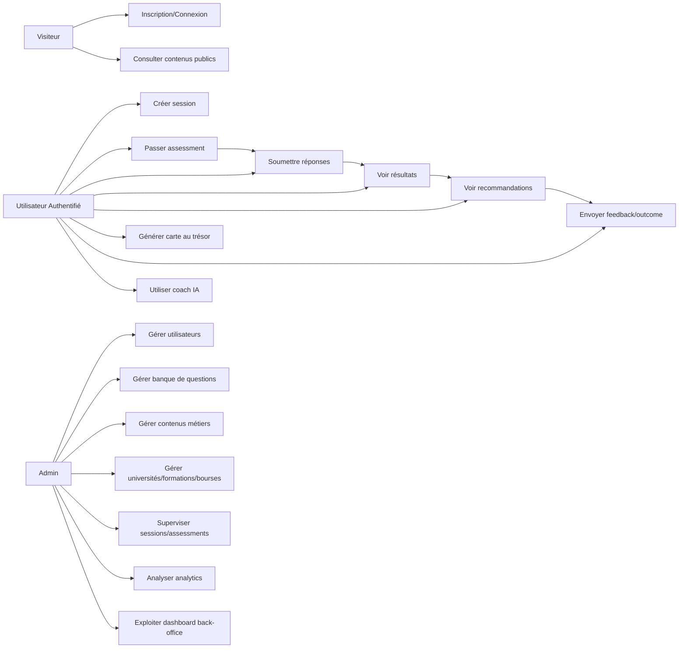

### 4.2 Cas d'usage détaillés (catalogue)
1. `AUTH-01` Inscription email/mot de passe.
2. `AUTH-02` Connexion + émission JWT.
3. `AUTH-03` Refresh token.
4. `AUTH-04` Vérification email.
5. `AUTH-05` Réinitialisation mot de passe.
6. `USER-01` Consultation profil courant.
7. `USER-02` Mise à jour profil.
8. `SES-01` Création session d'orientation.
9. `SES-02` Création assessment lié à une session.
10. `SES-03` Consultation session par token.
11. `QST-01` Récupération questions phase 1.
12. `QST-02` Récupération questions phase 2.
13. `QST-03` Récupération lot adaptatif suivant.
14. `RSP-01` Soumission réponses phase 1.
15. `RSP-02` Soumission réponses phase 2.
16. `RSP-03` Soumission batch adaptatif.
17. `SCR-01` Calcul score RIASEC.
18. `RES-01` Calcul résultat global assessment.
19. `RES-02` Lecture résultat enrichi.
20. `MAP-01` Génération carte au trésor.
21. `MAP-02` Consultation/partage carte.
22. `REC-01` Génération recommandations métiers.
23. `REC-02` Consultation recommandations.
24. `ANL-01` Capture interactions.
25. `ANL-02` Capture feedback.
26. `ANL-03` Capture outcomes.
27. `ANL-04` Synthèse analytics admin.
28. `AI-01` Résumé IA du profil.
29. `AI-02` Chat/coaching IA.
30. `CAR-01` CRUD carrières.
31. `RSC-01` CRUD ressources.
32. `UNI-01` CRUD universités.
33. `FRM-01` CRUD formations.
34. `SCH-01` CRUD bourses.
35. `BAD-01` Attribution badges/XP.
36. `BO-01` Dashboard back-office complet.
37. `BO-02` CRUD administratifs transverses.

## 5. Diagrammes de classes d'objets
### 5.1 Domaine utilisateur/auth/session
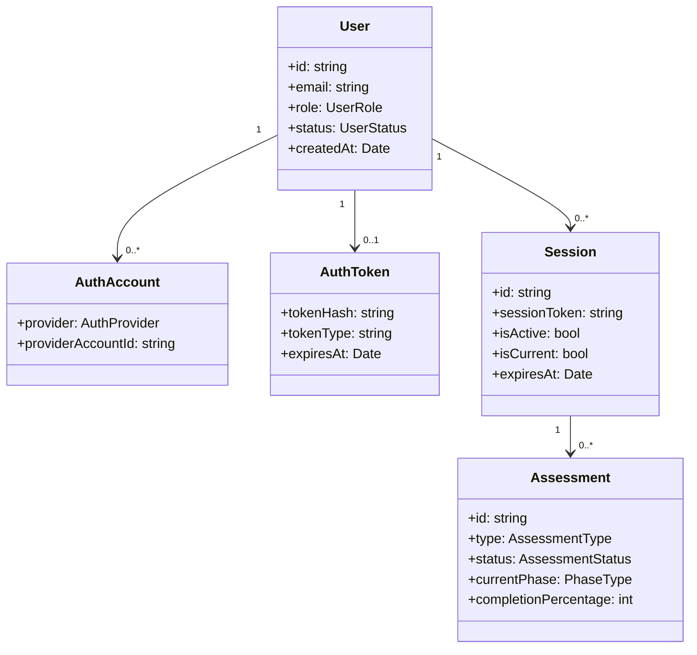

### 5.2 Domaine test/question/réponse/résultat
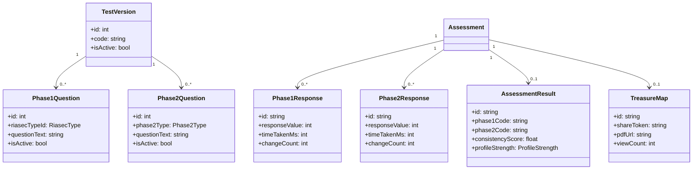

### 5.3 Domaine recommandations/formation/contenu
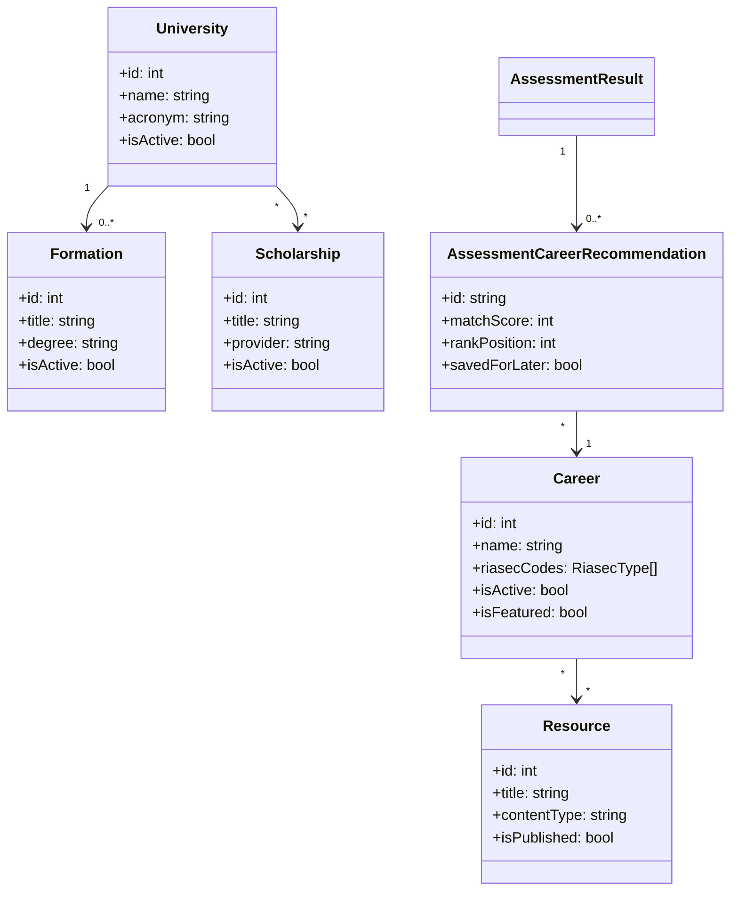

### 5.4 Domaine adaptatif et comportemental
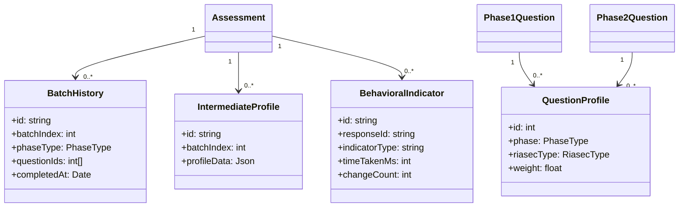

## 6. Diagrammes de séquence (scénarios clés)
### 6.1 Parcours nominal complet (de login à recommandations)
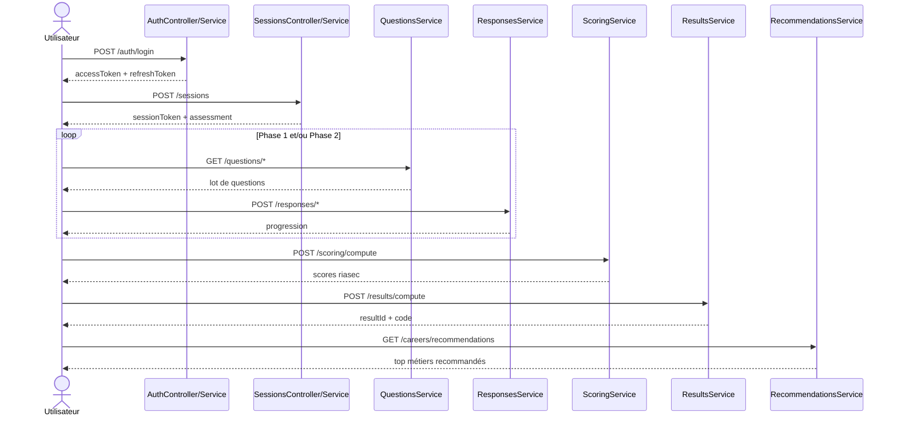

### 6.2 Flux adaptatif par batch
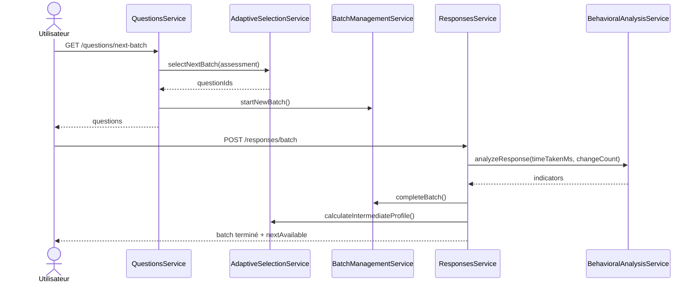

### 6.3 Génération de carte au trésor
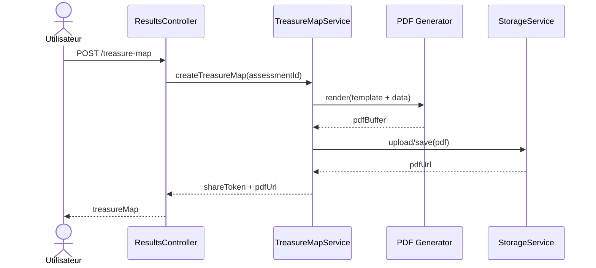

### 6.4 Back-office supervision
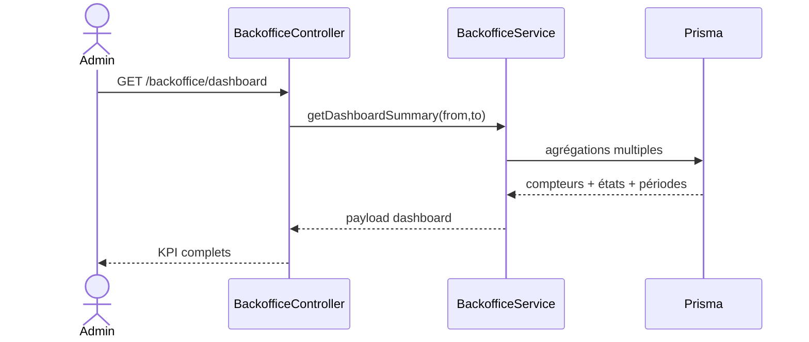

## 7. Diagrammes d'activité
### 7.1 Activité: Passage d'un test
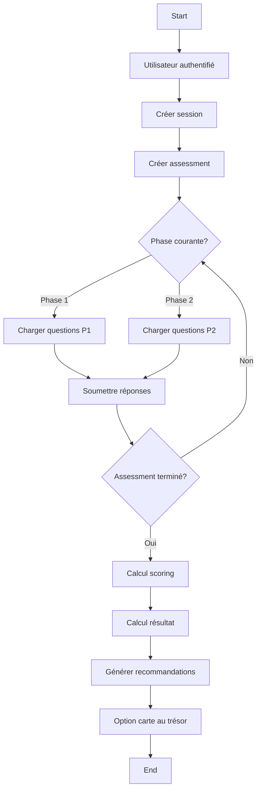

### 7.2 Activité: Gouvernance back-office
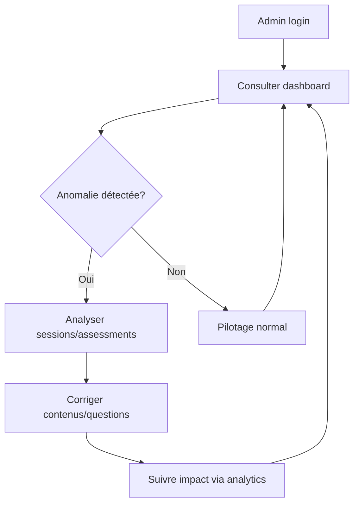

## 8. Diagrammes d'état
### 8.1 État d'un assessment
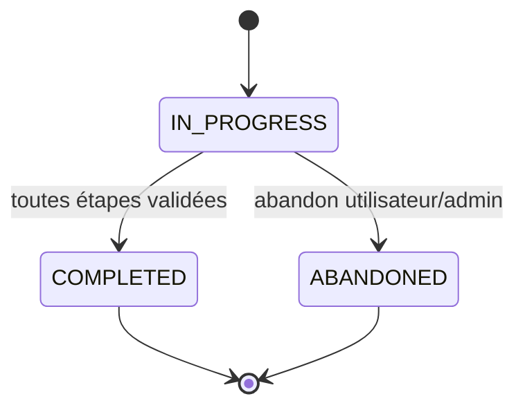

### 8.2 État d'un utilisateur
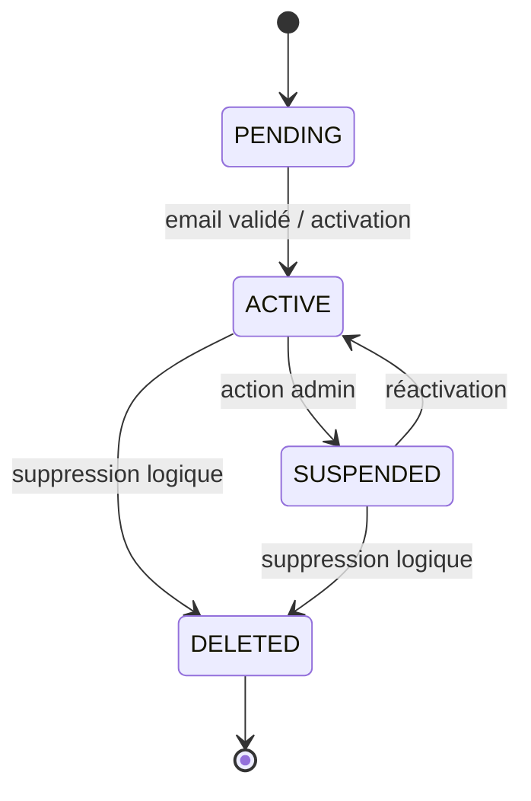

### 8.3 État publication ressource
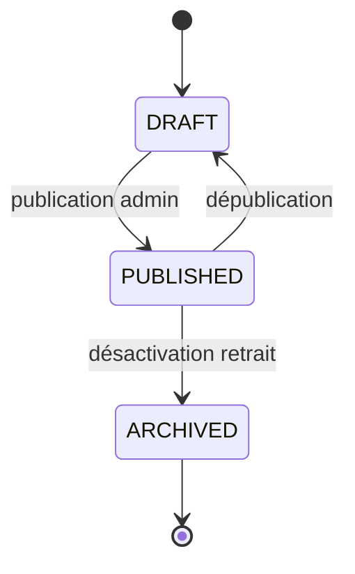

## 9. Diagramme de composants
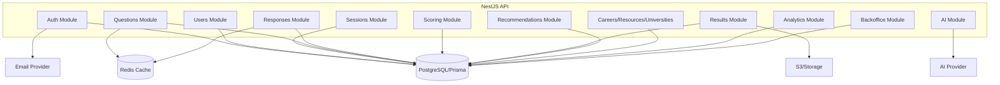

## 10. Diagramme de déploiement (logique)
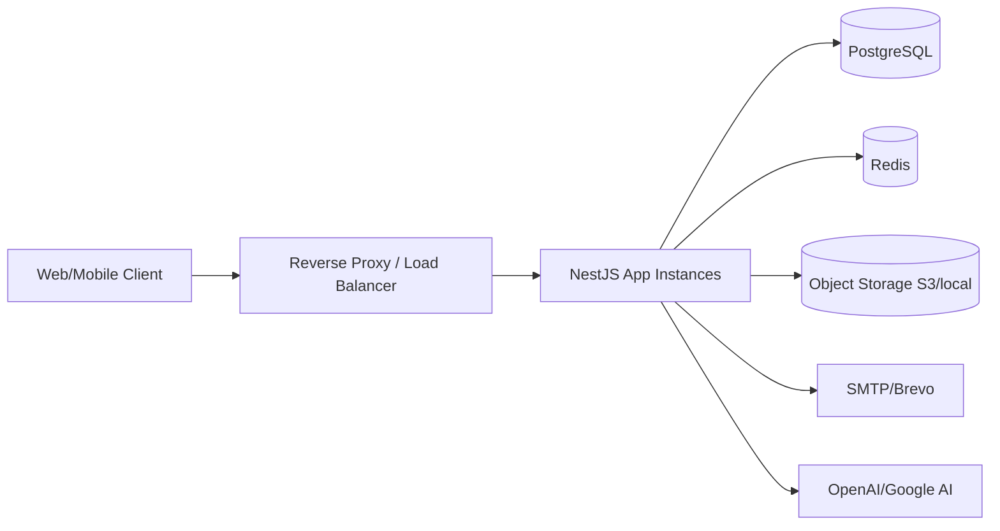

## 11. Matrice cas d'usage → modules
| Domaine | Cas d'usage principaux | Modules backend |
|---|---|---|
| Authentification | login/register/refresh/reset/verify | `auth`, `users`, `email` |
| Parcours test | création session, progression assessment | `sessions`, `assessments` |
| Questionnaire | chargement questions, sélection adaptative | `questions`, `responses` |
| Calcul | scoring, résultat, synthèse | `scoring`, `results`, `ai` |
| Recommandation | ranking métiers, feedback loop | `recommendations`, `careers`, `analytics` |
| Contenus | ressources, établissements, formations, bourses | `resources`, `universities`, `careers` |
| Pilotage | dashboard, CRUD admin transverse | `backoffice`, `analytics`, tous modules métier |

## 12. Cas de figure (nominal + alternatifs)
### 12.1 Nominal
1. Utilisateur se connecte.
2. Crée session + assessment initial.
3. Répond aux questions (phase 1 puis phase 2).
4. Reçoit résultat RIASEC et recommandations.
5. Fournit feedback et poursuit exploration.

### 12.2 Alternatifs/erreurs
1. `JWT absent/invalide` → `401 Unauthorized`.
2. `Rôle insuffisant` → `403 Forbidden`.
3. `Session introuvable/expirée` → `404/400`.
4. `Assessment non actif` pour soumission → `400`.
5. `Transition de phase invalide` (phase 2 avant phase 1) → `400`.
6. `Payload invalide` (validation pipe) → `400`.
7. `Throttle dépassé` → `429`.
8. `Ressource métier inexistante` → `404`.

### 12.3 Cas back-office
1. Supervision état global et période (`from/to`).
2. Détection déséquilibre pipeline (beaucoup `IN_PROGRESS`, peu `COMPLETED`).
3. Audit qualité contenu (`active/inactive`, `published/draft`).
4. Correction rapide via CRUD centralisé.

## 13. KPIs recommandés pour exploitation
- Taux de complétion assessment: `COMPLETED / total`.
- Taux d'abandon: `ABANDONED / total`.
- Temps médian par question et par batch.
- Distribution profils RIASEC dominants.
- Taux de consultation recommandations.
- Taux `savedForLater` sur recommandations.
- Taux publication contenus (`published/draft`).
- Cohérence profil moyenne (`consistencyScore`).

## 14. Limites actuelles et améliorations possibles
1. Ajouter diagrammes BPMN détaillés par rôle back-office.
2. Ajouter diagramme C4 niveau 1/2/3.
3. Ajouter traçabilité explicite endpoint -> règles métier -> tests.
4. Ajouter diagrammes de séquence pour refresh token, reset password, social login.
5. Ajouter catalogue événements asynchrones (email, IA, notifications).

## 15. Conclusion
La plateforme implémente une architecture modulaire robuste avec un noyau d'orientation RIASEC, un pipeline adaptatif, un écosystème de contenu et un back-office transversal. Les diagrammes ci-dessus couvrent les cas d'usage métier et techniques majeurs, et servent de base pour industrialiser design, QA, sécurité et roadmap produit.
