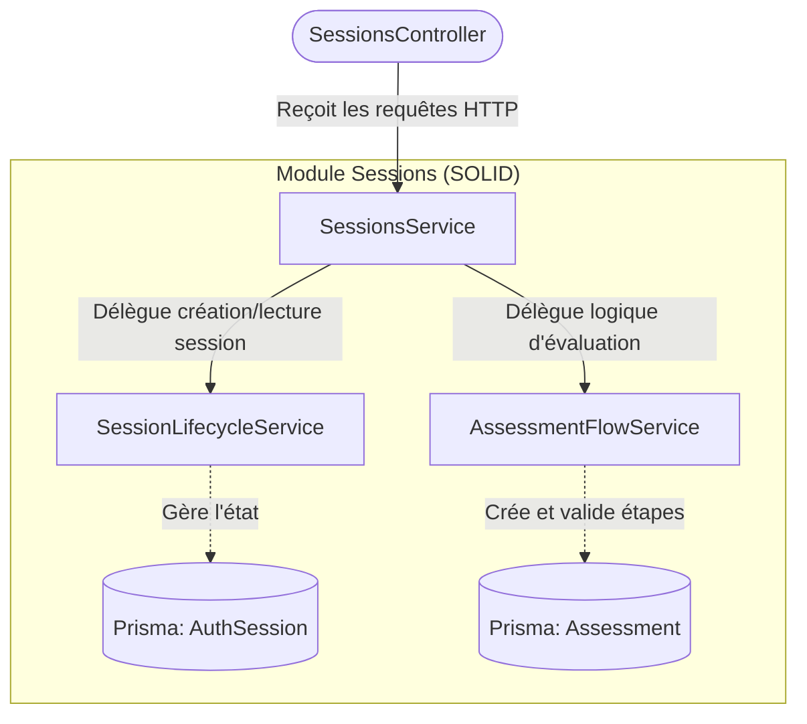

# Architecture du Module Sessions

Ce document explique l'organisation et la logique d'orchestration (selon les principes SOLID) mise en place dans le module `Sessions` (situé dans `src/modules/sessions`).

Afin d'éviter de créer un "God Object" (un objet qui sait tout faire et gère trop de responsabilités), le code a été divisé en trois services distincts. 

Voici le diagramme conceptuel de la communication entre ces trois éléments :

## 1. SessionsService (L'Orchestrateur / Facade)
**Fichier** : `src/modules/sessions/sessions.service.ts`

**Rôle Principal** : C'est le chef d'orchestre. Il ne réalise **aucune opération concrète** sur la base de données. Il se contente de lier la logique du cycle de vie de la session avec la logique de démarrage des évaluations. 

**Fonctionnement (Ex: `createSession`)** :
1. Il demande au `SessionLifecycleService` de générer un jeton de session (`session_token`) et de créer la session en base.
2. Il demande ensuite au `AssessmentFlowService` de créer la première évaluation (`Assessment`) en y rattachant l'identifiant de la session fraîchement créée.
3. Il renvoie l'objet structuré final au Contrôleur.

## 2. SessionLifecycleService (Gestion d'État)
**Fichier** : `src/modules/sessions/services/session-lifecycle.service.ts`

**Rôle Principal** : S'occupe exclusivement de la table `AuthSession` de Prisma et de la table liée `User`. 

**Responsabilités** :
- Générer un UUID aléatoire pour le `session_token`.
- Chiffrer ce jeton en SHA-256 pour générer le `session_hash` (mesure de sécurité imposée par votre base de données).
- Déclarer le délai de fin d'expiration (`expires_at`).
- Récupérer une session entière par son jeton et mettre à jour le profil (sauvegardé sur le modèle `User`).

## 3. AssessmentFlowService (Le Moteur de Règles)
**Fichier** : `src/modules/sessions/services/assessment-flow.service.ts`

**Rôle Principal** : S'occupe de la table `Assessment` (les instances des tests).

**Responsabilités** :
- Analyser et valider qu'un utilisateur a bien le droit de démarrer une phase avancée (*ex: a-t-il terminé PHASE 1 avant de commencer PHASE 2 OCCUPATIONS ?*)
- Résoudre la version du test courante (`test_version_id`).
- Formater les types `PHASE1`/`PHASE2` et mapper le tout conformément à la syntaxe `snake_case` de la base de données (`session_id`).

---

### Résumé de la liaison
- Si je veux modifier la façon dont les jetons d'identification (UUIDs) sont générés ➔ Je modifie `session-lifecycle.service`
- Si demain je veux ajouter une "PHASE 3" d'évaluation ➔ Je modifie `assessment-flow.service`
- Si je veux qu'à la création d'une session, on déclenche une tout autre évaluation en plus ➔ Je modifie la recette dans l'orchestrateur `sessions.service.ts`

Cette séparation totale garantit un code ultra-maintenable et un ciblage rapide des futurs bugs !
